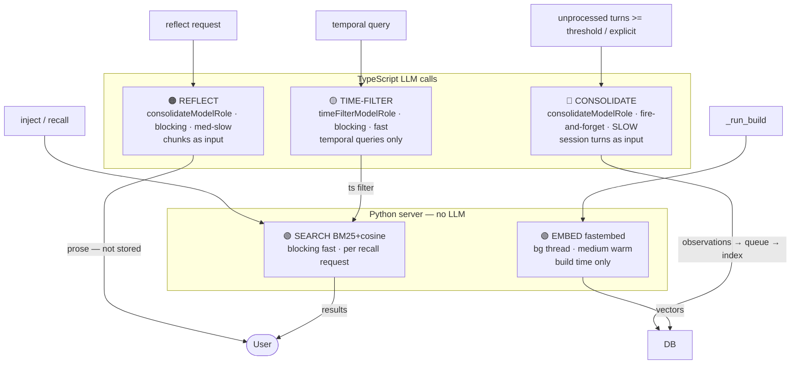
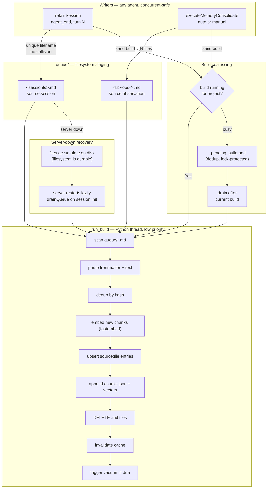
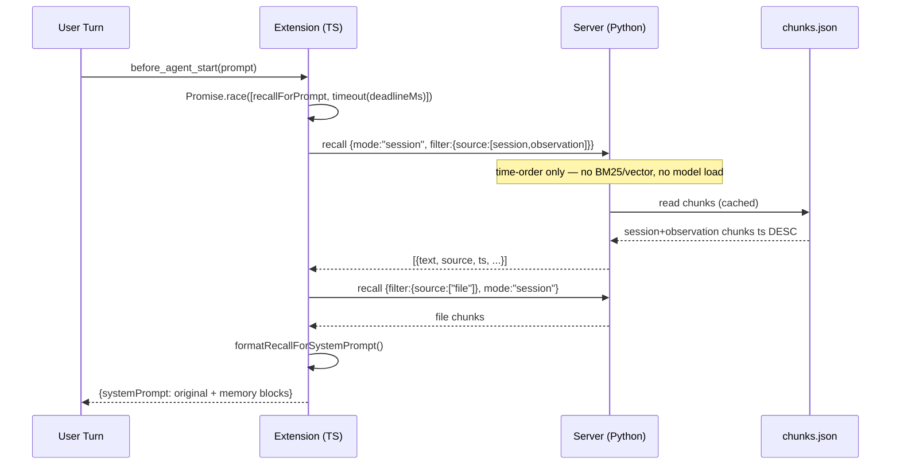
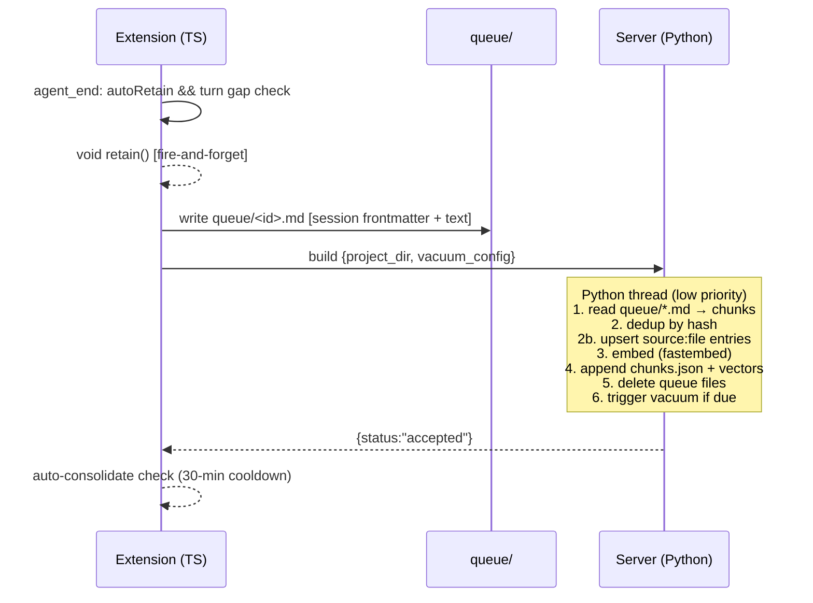
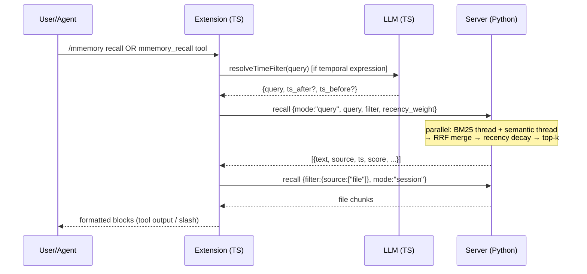
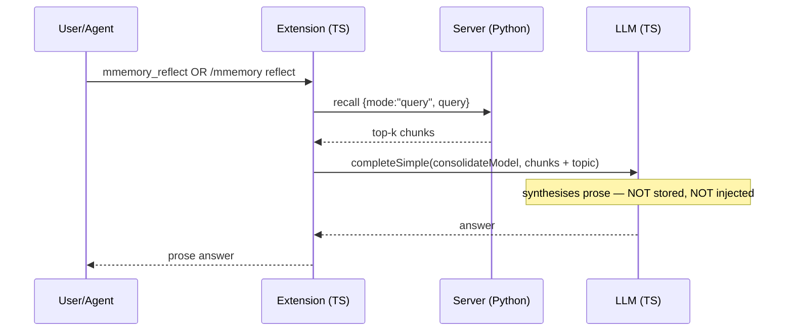
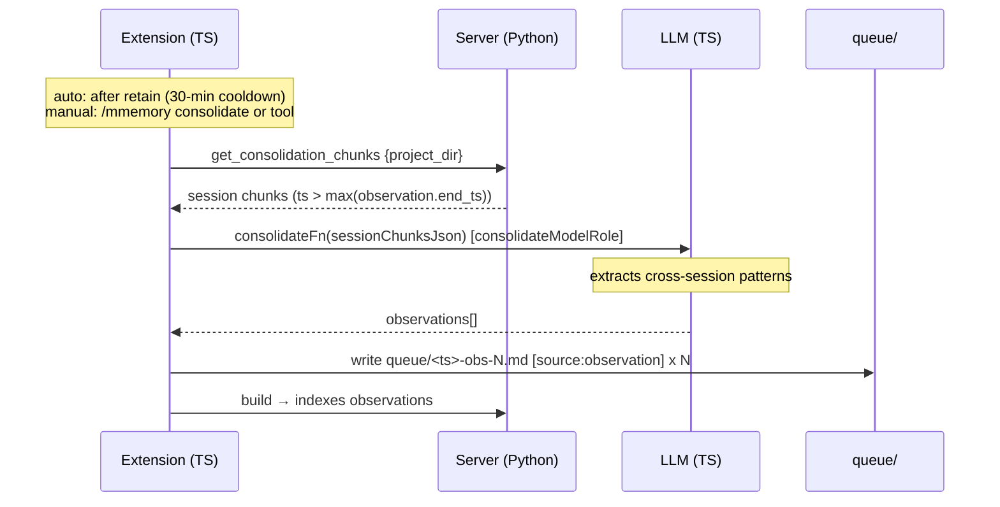
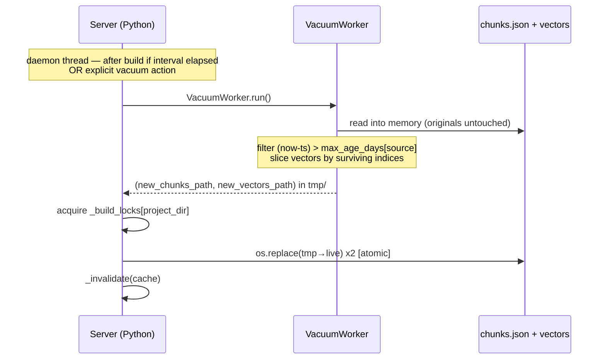
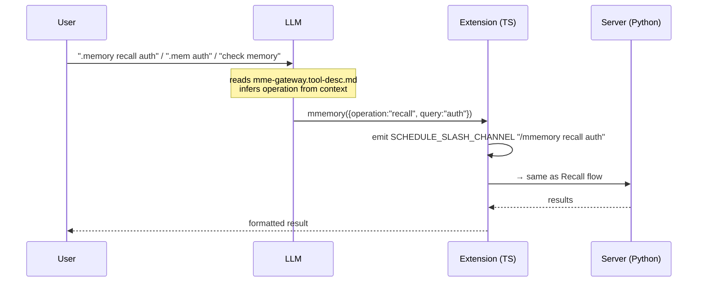

# mmemory — Local Semantic Memory

Persistent cross-session memory. Auto-recalls relevant context at session start; auto-retains session content after each turn. Fully offline — no cloud embedding API.

---

## Architecture

```
Extension (TypeScript)                Python server (TCP, port 49200)
──────────────────────────────        ─────────────────────────────────
session_start → init build   ──────→  build   → drain queue/*.md on startup
before_agent_start → recall  ──────→  recall  → BM25 + cosine + RRF + recency
agent_end → retain           ──────→  build   → embed + append chunks.json
session_shutdown → retain    ──────→  build   → final retain before exit
session.compacting → recall  ──────→  recall  → inject context into compactor
```

**Extension lifecycle (TypeScript):** `createMmemoryExtension` registers five event hooks via the `ExtensionAPI`:

- `session_start` — scaffolds storage dirs, writes `.gitignore` files, drains any orphaned queue files from before the server was ready.
- `before_agent_start` — on the first turn, composes a recall query from the user prompt plus recent context, queries the server, and injects the result into the system prompt. Subsequent turns reuse the cached snippet.
- `agent_end` — writes a queue file and triggers a background build every `retainEveryNTurns` turns. Suppressed for subagents (`taskDepth > 0`).
- `session_shutdown` — fires a final retain if turns have elapsed since the last one.
- `session.compacting` — recalls context and injects it into the compaction summarizer prompt.

**Python TCP server (`mmemory_server.py`):** Spawned on first use, holds the fastembed model in memory, auto-terminates after `serverIdleTimeoutMinutes` of inactivity. One server process handles all projects; project identity travels in every request as `project_dir`. A three-layer singleton guard prevents duplicate instances when multiple windows start simultaneously: pre-spawn port ping, PID file double-write CAS (50 ms window), and OS-level bind (`SO_EXCLUSIVEADDRUSE` on Windows).

**Queue-only ingress:** The extension never writes directly to `chunks.json`. All content enters through `queue/*.md` files with YAML frontmatter. The server reads, chunks, embeds, appends to the index, then deletes the queue files atomically.

**Unified index:** `chunks.json` holds all chunk types (session, observation, file). Retrieval uses parallel BM25 + cosine similarity, merged with Reciprocal Rank Fusion (RRF) and a configurable recency decay.

**Vacuum:** After each build the server checks whether the vacuum interval has elapsed. If so, it calls `VacuumWorker`, which writes filtered copies to `tmp/`, then the server does an atomic rename (`tmp/ → live files`). Live files are never modified in place.

---

## Storage Layout

All files live under a single `storageRoot` directory (one per configured scope):

```
storageRoot/
  chunks.json              Durable store — all chunks (session, observation, file).
                           Append-only; never modified in place. Rebuilt atomically.
  vectors.safetensors      BAAI/bge-small-en-v1.5 embeddings (384 dims).
                           Rebuilt from chunks.json when corrupt or after vacuum.
  vectors.meta.json        Model name + chunk count for incremental rebuild validation.
  queue/                   Transient .md files written by the extension.
    YYYYMMDD-HHMMSS-<sessionId>.md    Auto-retain — overwritten each cycle (same session).
    YYYYMMDD-HHMMSS-note-<id>.md      Tool-initiated retains (unique file per call).
  mental_models/           Seeded session summaries (Phase 3).
  mmemory-server.log       Python server stderr.
  mmemory-server-<port>.pid  Server PID (written on start, deleted on clean exit).
  vacuum-state.json        Timestamp of last vacuum run.
  tmp/                     Scratch dir for VacuumWorker output before atomic swap.
  .gitignore               Auto-written; excludes all memory data from git.
```

`storageRoot` defaults to (in priority order): `mmemory.storageRoot` setting → `$PI_CODING_AGENT_DIR/mmemory/` → `<binary-dir>/extensions/mmemory/` (compiled) → `~/.omp/mmemory/` (dev).

---

## Source Types

| Source | What it is | How it arrives | What queries it serves | `end_ts` |
|---|---|---|---|---|
| `session` | Turn-pair transcripts from auto-retain cycles. One chunk per user+assistant turn pair; long assistant turns are split at word boundaries. | Written to `queue/` by the extension on `agent_end` or `session_shutdown`; also by `mmemory_retain` tool. Deleted after build. | General context recall, "what did we do", "what was decided". Default source for session-start injection. | `= ts` |
| `observation` | Higher-level observations synthesised from accumulated session turns by `mmemory_consolidate`. Cross-session patterns. | Written to `queue/` by the consolidation path. | "what patterns emerged", "what do we know about X across sessions" — use `sources: ["observation"]` filter. | `= max(session.ts) across window` |
| `file` | Short file-inventory entries: `<basename> — modified/written/read`. One chunk per unique path, upserted (ts updated on each encounter). | Derived from `modified_files`/`written_files`/`read_files` arrays in session chunks during build. No separate queue file needed. | Explicit file-centric temporal queries: "what files were modified last week" — use `sources: ["file"]`. Not for understanding what happened to a file; BM25 handles that from session text. | `= ts` |

---

## Chunk Frontmatter Schema

Queue files carry YAML frontmatter stripped by the server before chunking. Fields are stored as chunk metadata and used for filtered recall.

**Session (`auto-retain` or `mmemory_retain` tool):**
```yaml
---
project: my-project/workspace     # normalized cwd: backslashes → /, drive colon stripped
agent_tag: default                 # isolates memories within the same project dir
source: session
session_id: <session-uuid>
ts: 1746000000                     # unix seconds (session start time for auto-retain)
---

# Memory — 2025-04-30

**Mission:** Focus on technical decisions, API contracts, constraints, error patterns, and conventions

**User:** ...

**Assistant:** ...
```


**Observation (from `mmemory_consolidate`):**
```yaml
---
source: observation
ts: 1746000000
project: my-project/workspace
entities: [auth, JWT, RS256]
date: 2025-04-30
---
The project consistently uses RS256 JWT authentication across all services. Key rotation happens every 90 days.
```

**File (synthesised during build — no separate queue file):**

File chunks are generated automatically from session `modified_files`/`written_files`/`read_files` arrays. They are not written as queue files; the server upserts them directly during the build pass. Their metadata: `source: file`, `path: <full path>`, `text: <basename> — modified`.

---

## Five Tools

| Tool | When the LLM calls it |
|---|---|
| `mmemory` (gateway) | User-triggered memory operations only. Call when the user signals memory intent via `.memory`, `.mem`, "check memory for X", "remember this", "what do we know about Y", or any explicit memory direction. Infers the sub-operation (`recall`/`retain`/`reflect`/`consolidate`) from phrasing. **Do not call** for autonomous agent-initiated memory access — use the direct tools below. |
| `mmemory_recall` | Agent independently decides past context is relevant: user asks about prior decisions, conventions, or work done in earlier sessions. Also triggered by `.memory recall <query>`, `recall <query>`, or `remember <query>`. Returns raw ranked memory chunks. |
| `mmemory_retain` | Agent needs to store something for future sessions: a decision just agreed, a constraint, an API contract, a bug fix. Triggered by `.memory retain <content>`, `.memory store <content>`, or when the user explicitly asks to remember something. |
| `mmemory_reflect` | User wants synthesis across multiple past sessions, not raw retrieval: "what do we know about X?", "summarise our approach to Y", "what patterns emerged around Z?". Calls an LLM over the retrieved chunks and produces a prose answer. Does not store anything. |
| `mmemory_consolidate` | User explicitly asks to consolidate memory, or enough unprocessed turns have accumulated. Fires automatically after retain when `unprocessed_turn_count >= consolidationMinTurns`. Expensive: reads `source:session` chunks newer than the consolidation watermark, calls an LLM to synthesise cross-session observations, writes `source:observation` queue files. Do not call speculatively. |

---

## Slash Commands

```
/mmemory recall <query>             Recall with current session scope.
/mmemory recall / <query>           One-time global recall (no project filter).
/mmemory reflect <query>            Reflect — LLM synthesis over recalled chunks.
/mmemory retain                     Write a queue file immediately (no wait for turn end).
/mmemory view                       Show the current recall snippet in the session.
/mmemory clear --from D --to D      Delete chunks in a date range (YYYY-MM-DD).
/mmemory clear --session <id>       Delete all chunks from a specific session.
/mmemory status                     Show scope, chunk count, enabled flag, storage path.
/mmemory enqueue <text>             Manually add text to the queue.
/mmemory consolidate               Force consolidation now (threshold bypassed — fires immediately).
/mmemory mm list                    List mental model files.
/mmemory mm regenerate              Regenerate all mental models.
/mmemory /                          Switch recall scope to global (no project filter).
/mmemory .                          Reset recall scope to current project (default).
/mmemory <name>                     Switch recall scope to a named project (e.g. my-project).
```

Scope changes (`/`, `.`, `<name>`) are session-sticky: they persist until the session ends or is overridden. `/mmemory recall / <query>` overrides scope for that one query only.

---

## Recall Injection

At session start (`before_agent_start`, first turn only), the extension queries the server and injects up to three sibling XML blocks into the system prompt:

```
<memories>
Relevant context from past sessions (prioritize recent entries; use older ones only if directly relevant):

---

• <session chunk text> [YYYY-MM-DD]
• <session chunk text> [YYYY-MM-DD]
</memories>

<observations>
• <observation text>  (entities: auth, JWT | date: 2025-03-15)
</observations>

<referenced_files>
/path/to/workspace/src/auth.ts
/path/to/workspace/src/api/routes.ts
</referenced_files>
```

Each block is omitted when empty. Blocks are independent — any combination may appear.

**`<memories>`** — session chunks, sorted ts ASC (oldest first, most recent last). Each bullet is one turn-pair chunk.

**`<observations>`** — consolidated observation chunks up to `recall.observationLimit`. Each bullet includes date range `[YYYY-MM-DD → YYYY-MM-DD]` and entity metadata when available. Appears ABOVE `<memories>` in the injected prompt.

**`<referenced_files>`** — file-inventory paths sorted ts ASC (most recently touched last), up to `recall.fileLimit`. Read-only files are excluded unless `recall.includeReadFiles` is true.

**`mode: session` vs `mode: query`:**
- `mode: session` (auto-inject at session start) — time-ordered retrieval, no BM25/vector scoring. Server filters to `session` and `observation` sources automatically.
- `mode: query` (user-driven `/mmemory recall`, tool calls) — full BM25 + cosine + RRF + recency. Time-filter preprocessing applies when the query contains temporal hints ("last week", "yesterday").

The mental models block `<mental_models>` (from `mental_models/` directory) is injected on every turn, not just the first, and is a separate sibling block.

---

## Source Filter Taxonomy

From `mme-recall-preamble.prompt.md` — match `sources` filter to user intent when calling `mmemory_recall`:

| User intent | `sources` filter |
|---|---|
| "what files were modified / created / changed [timeframe]?" | `["file"]` |
| "what did we find / observe / discover / notice?" | `["observation"]` |
| "what happened / what did we do / recent sessions?" | `["session"]` |
| "what happened / what did we do / recent sessions?" | `["session"]` |
| "what was happening when we touched `<file>`?" | omit — file name in session text, BM25 handles it |
| general / ambiguous / mixed intent | omit — all sources searched |

Notes:
- `sources` is optional and additive: `["session", "observation"]` returns both ranked together.
- `source: "file"` chunks are short inventory entries — use only for explicit file-centric temporal queries, not for understanding what happened to a file.
- When `mode: "session"` is active (auto-inject), sources are filtered server-side automatically; no need to specify `sources`.

---

## Vacuum

`VacuumWorker` (`mmemory_vacuum.py`) performs age-based purge of stale chunks.

**How it is triggered:** At the end of every successful build, the server checks `vacuum-state.json`. If `vacuum.enabled` is true and more than `vacuum.intervalHours` hours have elapsed since the last run, vacuum fires in the same build thread.

**What it does:**
1. Reads `chunks.json` and `vectors.safetensors` into memory (originals never modified).
2. Drops chunks whose age (current time − `ts`) exceeds the per-source threshold.
3. Writes filtered copies to `tmp/chunks-vacuum-<ts>.json` and `tmp/vectors-vacuum-<ts>.safetensors`.
4. Returns the new file paths to the server.
5. Server does atomic rename: `tmp/ → storageRoot/` (replaces live files).
6. Updates `vacuum-state.json` with the current timestamp.

**Age thresholds (defaults):**

| Source | Default max age |
|---|---|
| `session` | 365 days |
| `observation` | 90 days |
| `file` | 180 days |
Vectors are sliced by surviving indices — no re-embedding needed. If the vector file is missing or corrupt, vacuum writes a zero-vector placeholder and the server rebuilds on the next recall.

---

## Configuration

Configuration lives in the `mmemory:` block of the project config file (e.g. `config.yml`). Settings under `mmemory.*` map directly to `MmemoryConfig`.

**`mmemory.recall.*` keys:**

| Key | Default | Description |
|---|---|---|
| `mmemory.recall.limit` | `10` | Max chunks returned per recall query. |
| `mmemory.recall.deadlineMs` | `10000` | Hard timeout for the server call (ms). Recall is skipped on timeout. |
| `mmemory.recall.maxQueryChars` | `2000` | Max characters fed to the BM25/vector recall query. |
| `mmemory.recall.recencyWeight` | `0.3` | Recency blend factor: 0 = pure BM25, 1 = pure recency. Recommended: 0.2–0.4. |
| `mmemory.recall.fileLimit` | `20` | Max paths injected into `<referenced_files>`. |
| `mmemory.recall.includeReadFiles` | `false` | Include read-only files in `<referenced_files>`. |
| `mmemory.recall.observationLimit` | `10` | Max observations injected into `<observations>`. 0 = disabled. |
**`mmemory.vacuum.*` keys:**

| Key | Default | Description |
|---|---|---|
| `mmemory.vacuum.enabled` | `true` | Enable periodic age-based purge. |
| `mmemory.vacuum.intervalHours` | `24` | Minimum hours between automatic vacuum runs. |
| `mmemory.vacuum.sessionMaxAgeDays` | `365` | Purge `source:session` chunks older than this. |
| `mmemory.vacuum.observationMaxAgeDays` | `90` | Purge `source:observation` chunks older than this. |

**Other keys:**

| Key | Default | Description |
|---|---|---|
| `mmemory.enabled` | — | Must be `true`; extension does nothing if absent or false. |
| `mmemory.storageRoot` | (auto) | Full path to storage root. Supports `~`. |
| `mmemory.modelRole` | `"memory"` | Model role for extraction, reflect synthesis, consolidation. |
| `mmemory.timeFilterModelRole` | (falls back to `modelRole`) | Model role for temporal query preprocessing. |
| `mmemory.consolidateModelRole` | (falls back to `modelRole`) | Model role for consolidation. |
| `mmemory.agentTag` | `"default"` | Isolates memories within the same project directory. |
| `mmemory.retainMission` | (generic) | Instruction injected into the extraction prompt; guides what the LLM retains. |
| `mmemory.scoping` | `"per-project"` | Default recall scope (see Scoping below). |
| `mmemory.retainEveryNTurns` | `3` | Auto-retain fires every N agent turns. |
| `mmemory.retainContextTurns` | `3` | Number of turns included in each auto-retain transcript. |
| `mmemory.autoRetain` | `true` | Enable/disable automatic session retention. |
| `mmemory.maxTranscriptChars` | `0` | Truncate retained transcripts to this length. 0 = no limit. |
| `mmemory.consolidationMinTurns` | `10` | Auto-consolidation fires when unprocessed turn count reaches this threshold. |
| `mmemory.consolidationMaxTurns` | `50` | Max session turns fed to the consolidation LLM in one pass. |
| `mmemory.consolidationPollIntervalMinutes` | `5` | How often the extension polls the server for unprocessed turn count after a retain. |
| `mmemory.deduplicationThreshold` | `0.92` | Cosine similarity above which a chunk is considered duplicate and skipped. |
| `mmemory.serverPort` | `49200` | TCP port for the Python server. |
| `mmemory.serverIdleTimeoutMinutes` | `10` | Server self-terminates after this many idle minutes. |

---

## Scoping

Scope controls which chunks are included when composing the `project` filter on recall.

| Scope | What it filters | How to set |
|---|---|---|
| `per-project` | Chunks matching the current working directory's normalized label only. Default. | `mmemory.scoping: per-project` in config, or `/mmemory .` to reset session scope. |
| `per-project-tagged` | Chunks matching both the project label and `agentTag`. Use when multiple agents share a directory but should have separate memories. | `mmemory.scoping: per-project-tagged`. |
| `global` | No project or agent filter — all chunks in the index. | `mmemory.scoping: global` in config; `/mmemory /` for session-scoped global; or `scope: null` in a tool call. |

**Session-level override:** `/mmemory /` switches to global for the rest of the session; `/mmemory .` resets to project default; `/mmemory <name>` pins to a named project label. These are session-sticky and do not persist to config.

**One-shot override:** `/mmemory recall / <query>` or passing `scope: "global"` to `mmemory_recall` overrides scope for that single call without changing session state.

**Project label derivation:** The label is the normalized cwd — backslashes replaced with forward slashes, drive colon stripped. `C:\repos\my-project` → `C/repos/my-project`. Not configurable; use `agentTag` to isolate within the same directory.

---

## .memory / .mem Triggers

The `mmemory` gateway tool (registered as `mmemory` in the tool manifest) handles all user-triggered memory operations via the LLM. There is no hardcoded prefix dispatch in the extension; the LLM infers intent from the user's phrasing.

**Canonical triggers:** `.memory <anything>`, `.mem <anything>`.

**Written-out triggers:** "memory recall X", "check memory for X", "remember this", "what do we know about Y", "recall our decisions on Z", or any phrase where the user is explicitly directing memory — not asking the agent to reason from context.

**Operation inference (gateway tool):**
- `recall` — user wants to retrieve past context or check prior decisions (default if unclear).
- `retain` — user wants to store something for future sessions.
- `reflect` — user wants a synthesised summary of what is known about a topic.
- `consolidate` — user explicitly asks to consolidate or compress memory.

**`mreview` pattern:** When a user triggers `.review` (the markdown review tool), the mmemory gateway is not involved. Each `m*` tool has its own gateway or direct wiring — the pattern is consistent but there is no shared prefix router.

**Direct tool calls:** When the agent autonomously decides to check or store memory (without user direction), it calls `mmemory_recall`, `mmemory_retain`, `mmemory_reflect`, or `mmemory_consolidate` directly — not via the gateway.

---

## Consolidation

Consolidation reads `source:session` chunks newer than the watermark (`ts > max(observation.end_ts)`) and calls an LLM to synthesise higher-level cross-session observations, writing `source:observation` queue files. The server indexes them on the next build.

**Watermark:** `end_ts` on existing `source:observation` chunks tracks how far consolidation has processed. Only session turns beyond this watermark are fed to the LLM, preventing re-consolidation of already-processed content.

**Trigger:** Count-based. After each `mmemory_retain`, the extension calls `get_consolidation_chunks` on the server to get unprocessed session chunks (those with `ts > max(observation.end_ts)`). If `unprocessed_turn_count >= consolidationMinTurns`, consolidation fires.

**LLM call location:** TypeScript only. `buildConsolidateFn` (in `index.ts`) constructs the LLM call and passes it to `executeMemoryConsolidate`. The Python server is never involved in LLM calls. The call uses `consolidateModelRole` (falls back to `modelRole` → `memory` role → smol). TypeScript computes `start_ts` (oldest turn ts in the window) and `end_ts` (newest) before writing observation queue files.

**Non-blocking:** All paths fire consolidation as a non-awaited Promise (fire-and-forget) — the user is never blocked. The LLM call runs in the Node.js async event loop while the agent continues normally.

**Trigger paths:**

| Path | How triggered | Threshold |
|---|---|---|
| Auto-background | Client polls server via `get_consolidation_chunks` after each retain; fires when `unprocessed_turn_count >= consolidationMinTurns` | `consolidationMinTurns` (default 10) |
| `/mmemory consolidate` | User issues slash command — force-now | threshold:1 (always runs) |
| `mmemory_consolidate` tool | Agent calls autonomously | threshold:1 (always runs) |

**LLM output:** `[{observation, entities, date}]`. TypeScript derives `start_ts` and `end_ts` from the input window.

**Output:** `queue/<ts>-obs-NNNN.md` files with `source: observation`, `start_ts`, and `end_ts` frontmatter. Server ingests them on next build. Observations age out at `vacuum.observationMaxAgeDays` (default: 90 days).

> **Note:** core memory (`MEMORY.md`, `memory_summary.md`) is a separate system managed outside mmemory. mmemory replaces it for injection purposes — session-start recall injects `<observations>` and `<memories>` blocks instead of reading core memory files.
---

## Prerequisites

```
pip install fastembed safetensors numpy
```

**Python 3.10+** required. (The server uses `type X | Y` union syntax.)

**Model download:** On first use, `BAAI/bge-small-en-v1.5` (~25 MB) downloads to `~/.cache/fastembed/` (or `%LOCALAPPDATA%/fastembed/` on Windows). Subsequent starts load from cache. The model is held in memory for the duration of the server process.


---

## Flow Diagrams

### LLM Calls & Slow Operations — Overview

**TypeScript-side only. The Python server never calls an LLM.**

| Call site | Model role | Blocking? | Speed | Trigger | Output |
|---|---|---|---|---|---|
| `resolveTimeFilter` | `timeFilterModelRole` | **Yes** — inline before query | Fast | temporal expression in query only | ts_after/ts_before filter |
| `executeMemoryConsolidate` | `consolidateModelRole` | **No** — fire-and-forget Promise | **SLOW** — large context | `unprocessed_turn_count >= consolidationMinTurns` OR explicit | `source:observation` queue files |
| `executeMemoryReflect` | `consolidateModelRole` | **Yes** — user waits | Medium-slow | mmemory_reflect / /mmemory reflect | prose answer — not stored |
| fastembed _(not LLM)_ | bge-small-en-v1.5 local | **No** — Python bg thread | Medium warm | `_run_build` new chunks | rows appended to vectors.safetensors |

**No LLM during:** session inject, vacuum, build (embed only), BM25+vector recall search.




### Inject vs Recall — key distinction

| | Inject | Recall |
### Queue Lifecycle (concurrent-safe ingress)

Three concurrent-safe properties:
1. **Unique filenames** — `<sessionId>.md`, `<ts>-obs-NNNN.md` — no two agents write the same file
2. **Build coalescing** — concurrent build requests are deduplicated per project into `_pending_build` (lock-protected); drained after current build
3. **Server-down recovery** — files accumulate on disk; `drainQueue()` on session init processes them when server restarts



|---|---|---|
| **Trigger** | Automatic, `before_agent_start` | User/agent explicit request |
| **Mode** | `session` — time-ordered, no BM25 | `query` — BM25+vector+recency |
| **Output** | Appended to system prompt | Tool output / slash response |
| **LLM** | Never | Only for time-filter parsing |
| **Deadline** | Hard (`recallDeadlineMs`) | None |

### Inject



### Retain



### Recall



### Reflect



### Consolidate



### Vacuum



### Gateway (.memory / .mem / natural language triggers)



The server emits a clear error to its log file if `fastembed` or `safetensors` is not installed; it does not crash silently.

---

## Attribution

Inspired by **Hindsight** by Vectorize ([Apache 2.0](https://github.com/vectorize-io/hindsight)).

The following design elements are derived from Hindsight:
- **`retainMission`** — injected into the **extraction system prompt** to scope what the LLM retains; also written to each session `.md` file header as `**Mission:** <text>`. Not injected into recall or consolidate prompts.
- **Recall architecture** — session-start injection, per-project scoping model, and the queue-then-build ingress pattern.
